# Terms & Conditions Risk Analyzer

A privacy-focused web application that analyzes Terms and Conditions from major platforms and presents privacy risks in a user-friendly interface. Built with AWS Bedrock (Claude AI) and DynamoDB.

## Overview

Most users never read Terms & Conditions before accepting them. This tool helps users understand what they're agreeing to by:

- Analyzing T&C documents using AI (Claude 3 Haiku via AWS Bedrock)
- Identifying and categorizing privacy risks (High/Medium/Low)
- Presenting findings in an intuitive card-based UI
- Allowing users to add and analyze new company T&Cs

## System Architecture


## Data Flow - Analyze T&C

```mermaid
sequenceDiagram
    autonumber
    participant U as 👤 User
    participant F as 🖥️ Frontend
    participant B as ⚙️ Backend
    participant DB as 🗄️ DynamoDB
    participant AI as 🤖 Bedrock

    U->>F: Click company card
    F->>B: GET /api/companies/{id}
    B->>DB: Query company data
    DB-->>B: Return company + T&C
    B-->>F: Company JSON
    F->>U: Display modal with details

    U->>F: Click "Analyze with AI"
    F->>B: POST /api/companies/{id}/analyze

    B->>DB: Fetch T&C text
    DB-->>B: T&C document

    B->>AI: Invoke Claude model
    Note over B,AI: Send T&C for analysis
    AI-->>B: Risk analysis JSON

    B->>DB: Save analysis results
    DB-->>B: Confirmation

    B-->>F: Updated company data
    F->>U: Display risks with severity
```



## Adding New Company Flow

```mermaid
sequenceDiagram
    autonumber
    participant U as 👤 User
    participant F as 🖥️ Frontend
    participant B as ⚙️ Backend
    participant DB as 🗄️ DynamoDB
    participant AI as 🤖 Bedrock

    U->>F: Click "+ Add Company"
    F->>U: Show upload form

    U->>F: Submit (name, category, T&C text)
    F->>B: POST /api/companies

    B->>DB: Create company record
    DB-->>B: Company created

    B->>AI: Analyze T&C text
    AI-->>B: Risks + Summary

    B->>DB: Update with analysis
    DB-->>B: Updated

    B-->>F: New company data
    F->>U: Show in grid + open modal
```



## Component Architecture


## Risk Severity Distribution


## Features

| Feature | Description |
|---------|-------------|
| Company Cards | Visual grid of companies with risk indicators |
| Risk Analysis | AI-powered analysis using Claude 3 Haiku |
| Risk Severity | Color-coded risk levels (High/Medium/Low) |
| Add Companies | Upload new T&C for any company |
| Sample Data | Pre-loaded data for Facebook, TikTok, Tinder, X, Instagram, LinkedIn |

## Tech Stack

```mermaid
flowchart LR
    subgraph Stack["Technology Stack"]
        direction TB
        FE["🎨 Frontend<br/>HTML • CSS • JavaScript"]
        BE["⚙️ Backend<br/>Python • FastAPI"]
        DB["🗄️ Database<br/>AWS DynamoDB"]
        AI["🤖 AI/LLM<br/>AWS Bedrock • Claude 3"]
    end

    FE --> BE --> DB
    BE --> AI

    style FE fill:#4caf50,color:#fff
    style BE fill:#2196f3,color:#fff
    style DB fill:#ff9800,color:#fff
    style AI fill:#9c27b0,color:#fff
```



## Prerequisites

- Python 3.9+
- AWS Account with Bedrock and DynamoDB access
- AWS credentials with permissions for:
  - `bedrock:InvokeModel`
  - `dynamodb:*`

## Installation

1. **Clone the repository**
   ```bash
   git clone https://github.com/AlmazErmilov/aws-hack-prototype-terms-and-conditions-ass.git
   cd aws-hack-prototype-terms-and-conditions-ass
   ```

2. **Create virtual environment**
   ```bash
   python3 -m venv venv
   source venv/bin/activate  # On Windows: venv\Scripts\activate
   ```

3. **Install dependencies**
   ```bash
   pip install -r requirements.txt
   ```

4. **Configure AWS credentials**

   Create a `.env` file in the root directory:
   ```env
   AWS_ACCESS_KEY_ID=your_access_key
   AWS_SECRET_ACCESS_KEY=your_secret_key
   AWS_SESSION_TOKEN=your_session_token  # If using temporary credentials
   ```

5. **Run the application**
   ```bash
   cd backend
   python -m uvicorn main:app --reload --host 0.0.0.0 --port 8000
   ```

6. **Open in browser**
   ```
   http://localhost:8000
   ```

## Usage

### Loading Sample Data
Click "Load Sample Data" to populate the database with pre-configured companies.

### Viewing Risks
Click on any company card to view:
- Summary of what users agree to
- List of privacy risks with severity levels
- Detailed descriptions of each risk

### Analyzing T&C
Click "Analyze with AI" to generate or refresh the risk analysis using Claude.

### Adding New Companies
1. Click "+ Add Company"
2. Enter company name and category
3. Paste the Terms & Conditions text
4. Submit to analyze

## API Reference

```mermaid
flowchart LR
    subgraph Endpoints["API Endpoints"]
        direction TB
        G1["GET /api/companies"]
        G2["GET /api/companies/{id}"]
        P1["POST /api/companies"]
        P2["POST /api/companies/{id}/analyze"]
        P3["POST /api/seed"]
        D1["DELETE /api/companies/{id}"]
    end

    G1 --> |"List all"| R1["📋 Company[]"]
    G2 --> |"Get one"| R2["📄 Company"]
    P1 --> |"Create + Analyze"| R3["📄 Company"]
    P2 --> |"Re-analyze"| R4["📄 Company"]
    P3 --> |"Load samples"| R5["✅ Status"]
    D1 --> |"Remove"| R6["✅ Status"]
```



| Method | Endpoint | Description |
|--------|----------|-------------|
| `GET` | `/api/companies` | List all companies |
| `GET` | `/api/companies/{id}` | Get company by ID |
| `POST` | `/api/companies` | Create company + analyze T&C |
| `POST` | `/api/companies/{id}/analyze` | Re-analyze company T&C |
| `DELETE` | `/api/companies/{id}` | Delete company |
| `POST` | `/api/seed` | Load sample data |

### Example Response

```json
{
  "id": "uuid-here",
  "name": "Facebook",
  "category": "social",
  "summary": "Users agree to allow Facebook to collect, share, and commercially exploit their data...",
  "risks": [
    {
      "title": "Extensive Data Collection",
      "description": "Facebook collects information you provide, content you create, and information about your connections.",
      "severity": "high"
    }
  ]
}
```

## Project Structure

```
├── backend/
│   ├── main.py              # FastAPI application & routes
│   ├── models.py            # Pydantic data models
│   └── services/
│       ├── __init__.py
│       ├── bedrock.py       # AWS Bedrock integration
│       └── dynamodb.py      # DynamoDB operations
├── frontend/
│   ├── index.html           # Main HTML page
│   ├── styles.css           # CSS styling
│   └── app.js               # Frontend JavaScript
├── docs/
│   └── PROGRESS.md          # Development progress
├── .env.example             # Environment template
├── .gitignore
├── requirements.txt
├── run.sh                   # Quick start script
└── README.md
```

## Risk Categories

The AI analyzes T&C documents for these privacy concerns:

| Category | Description | Severity |
|----------|-------------|----------|
| 🔴 Data Collection | What personal data is gathered | High |
| 🔴 Data Sharing | Who receives your data | High |
| 🟡 User Tracking | How your activity is monitored | Medium |
| 🟡 Content Rights | Licensing of your content | Medium |
| 🟡 Account Termination | Platform's right to remove you | Medium |
| 🟢 Arbitration | Dispute resolution limitations | Low |
| 🟢 Financial Impact | Hidden costs or implications | Low |

## Sample Companies Included

| Company | Category | Platform Type |
|---------|----------|---------------|
| Facebook | Social | Social Media |
| TikTok | Social | Short Video |
| Tinder | Dating | Dating App |
| X (Twitter) | Social | Microblogging |
| Instagram | Social | Photo Sharing |
| LinkedIn | Professional | Networking |

## Development

### Running in Development Mode
```bash
cd backend
python -m uvicorn main:app --reload --host 0.0.0.0 --port 8000
```

### API Documentation
Access Swagger UI at: `http://localhost:8000/docs`

## License

MIT License

## Acknowledgments

- Built during AWS Hackathon
- Powered by AWS Bedrock and Claude AI
- Privacy awareness inspired by GDPR principles
