# Terms & Conditions Risk Analyzer

A privacy-focused web application that analyzes Terms and Conditions from major platforms and presents privacy risks in a user-friendly interface. Built with AWS Bedrock (Claude AI) and DynamoDB.

## Overview

Most users never read Terms & Conditions before accepting them. This tool helps users understand what they're agreeing to by:

- Analyzing T&C documents using AI (Claude Sonnet 4 via AWS Bedrock)
- Identifying and categorizing privacy risks (High/Medium/Low)
- Presenting findings in an intuitive card-based UI
- Allowing users to add and analyze new company T&Cs

## System Architecture

```mermaid
flowchart TB
    subgraph Client["🖥️ Client Browser"]
        UI["Frontend UI<br/>(HTML/CSS/JS)"]
        Cards["Company Cards Grid"]
        Modal["Risk Analysis Modal"]
        Form["Upload T&C Form"]
        Analytics["📊 Analytics Dashboard<br/>(Chart.js)"]
    end

    subgraph Backend["⚙️ FastAPI Backend"]
        API["REST API<br/>Endpoints"]
        DBS["DynamoDB<br/>Service"]
        BRS["Bedrock<br/>Service"]
        VDS["Vector DB<br/>Service"]
    end

    subgraph AWS["☁️ AWS Cloud"]
        DDB[("DynamoDB<br/>TermsAndConditions")]
        BDK["Bedrock<br/>Claude Sonnet 4"]
        OSS[("OpenSearch<br/>Serverless")]
    end

    UI --> Cards
    UI --> Modal
    UI --> Form
    UI --> Analytics

    Cards <-->|"HTTP/JSON"| API
    Modal <-->|"HTTP/JSON"| API
    Form <-->|"HTTP/JSON"| API
    Analytics <-->|"Uses cached<br/>company data"| Cards

    API --> DBS
    API --> BRS
    API --> VDS

    DBS <-->|"AWS SDK"| DDB
    BRS <-->|"AWS SDK"| BDK
    VDS <-->|"AWS SDK"| OSS

    style Client fill:#e1f5fe
    style Backend fill:#fff3e0
    style AWS fill:#fce4ec
```



## Data Flow - Analyze T&C

```mermaid
sequenceDiagram
    autonumber
    participant U as 👤 User
    participant F as 🖥️ Frontend
    participant B as ⚙️ Backend
    participant DB as 🗄️ DynamoDB
    participant AI as 🤖 Bedrock

    U->>F: Click company card
    F->>B: GET /api/companies/{id}
    B->>DB: Query company data
    DB-->>B: Return company + T&C
    B-->>F: Company JSON
    F->>U: Display modal with details

    U->>F: Click "Analyze with AI"
    F->>B: POST /api/companies/{id}/analyze

    B->>DB: Fetch T&C text
    DB-->>B: T&C document

    B->>AI: Invoke Claude model
    Note over B,AI: Send T&C for analysis
    AI-->>B: Risk analysis JSON

    B->>DB: Save analysis results
    DB-->>B: Confirmation

    B-->>F: Updated company data
    F->>U: Display risks with severity
```



## Adding New Company Flow

```mermaid
sequenceDiagram
    autonumber
    participant U as 👤 User
    participant F as 🖥️ Frontend
    participant B as ⚙️ Backend
    participant DB as 🗄️ DynamoDB
    participant AI as 🤖 Bedrock

    U->>F: Click "+ Add Company"
    F->>U: Show upload form

    U->>F: Submit (name, category, T&C text)
    F->>B: POST /api/companies

    B->>DB: Create company record
    DB-->>B: Company created

    B->>AI: Analyze T&C text
    AI-->>B: Risks + Summary

    B->>DB: Update with analysis
    DB-->>B: Updated

    B-->>F: New company data
    F->>U: Show in grid + open modal
```



## Analytics Dashboard

The Analytics Dashboard provides visual insights into risk data across all analyzed companies using interactive Chart.js visualizations.

### Analytics Data Flow

```mermaid
flowchart LR
    subgraph DataSource["📦 Data Source"]
        Companies["companies[]<br/>Array in Memory"]
    end

    subgraph Processing["⚙️ Data Processing"]
        Aggregate["processAnalyticsData()"]

        subgraph Metrics["Calculated Metrics"]
            direction TB
            M1["Total Risks"]
            M2["By Severity"]
            M3["By Policy Type"]
            M4["By Company"]
            M5["By Category"]
        end
    end

    subgraph Visualization["📊 Chart.js Rendering"]
        direction TB
        C1["🍩 Severity<br/>Distribution"]
        C2["📊 Risks by<br/>Company"]
        C3["🍩 Policy Type<br/>Breakdown"]
        C4["📊 Stacked<br/>Severity"]
        C5["📊 Category<br/>Statistics"]
        C6["📋 Summary<br/>Stats Panel"]
    end

    Companies --> Aggregate
    Aggregate --> M1 & M2 & M3 & M4 & M5
    M2 --> C1
    M4 --> C2
    M3 --> C3
    M4 --> C4
    M5 --> C5
    M1 & M2 --> C6

    style DataSource fill:#e3f2fd
    style Processing fill:#fff3e0
    style Visualization fill:#e8f5e9
```



### Analytics Dashboard Components

```mermaid
flowchart TB
    subgraph Dashboard["📊 Analytics Dashboard Modal"]
        direction TB

        subgraph Row1["Top Row"]
            direction LR
            Severity["🍩 Risk Severity<br/>Distribution<br/><i>High/Medium/Low</i>"]
            CompanyBar["📊 Risks by Company<br/><i>Horizontal bar chart</i>"]
            PolicyType["🍩 Risks by Policy<br/>Type<br/><i>Terms/Cookie/Privacy</i>"]
        end

        subgraph Row2["Middle Row - Full Width"]
            StackedBar["📊 Severity Breakdown by Company<br/><i>Stacked bar chart showing High/Medium/Low per company</i>"]
        end

        subgraph Row3["Bottom Row"]
            direction LR
            CategoryBar["📊 Category Statistics<br/><i>Avg risks per category</i>"]
            StatsPanel["📋 Summary Panel<br/>• Total Companies<br/>• Total Risks<br/>• High/Medium/Low counts<br/>• Avg Risks/Company"]
        end
    end

    style Dashboard fill:#f5f5f5
    style Row1 fill:#e3f2fd
    style Row2 fill:#fff3e0
    style Row3 fill:#e8f5e9
```



### Chart Types and Data Mapping


### Analytics User Flow


### Severity Color Scheme

| Severity | Color | Hex Code | Usage |
|----------|-------|----------|-------|
| High | Red | `#f44336` | Critical privacy risks |
| Medium | Orange | `#ff9800` | Moderate concerns |
| Low | Green | `#4CAF50` | Minor issues |

### Policy Type Color Scheme

| Policy Type | Color | Hex Code |
|-------------|-------|----------|
| Terms & Conditions | Purple | `#667eea` |
| Cookie Policy | Orange | `#ff9800` |
| Privacy Policy | Violet | `#9c27b0` |

## Component Architecture


## Risk Severity Distribution


> **Legend**: 3 = High (🔴), 2 = Medium (🟡), 1 = Low (🟢)

## Features

| Feature | Description |
|---------|-------------|
| Company Cards | Visual grid of companies with risk indicators |
| Risk Analysis | AI-powered analysis using Claude Sonnet 4 |
| Risk Severity | Color-coded risk levels (High/Medium/Low) |
| Add Companies | Upload new T&C for any company |
| URL Scraping | Automatically fetch T&C from company URLs |
| RAG Chat | Ask questions about terms across all companies |
| **Analytics Dashboard** | Interactive charts and visualizations of risk data |
| Policy Types | Analyze Terms, Cookie, and Privacy policies separately |
| Sample Data | Pre-loaded data for Facebook, TikTok, Tinder, X, Instagram, LinkedIn |

## Tech Stack

```mermaid
flowchart LR
    subgraph Stack["Technology Stack"]
        direction TB
        FE["🎨 Frontend<br/>HTML • CSS • JavaScript • Chart.js"]
        BE["⚙️ Backend<br/>Python • FastAPI"]
        DB["🗄️ Database<br/>AWS DynamoDB"]
        VS["🔍 Vector Search<br/>OpenSearch Serverless"]
        AI["🤖 AI/LLM<br/>AWS Bedrock • Claude Sonnet 4"]
    end

    FE --> BE --> DB
    BE --> VS
    BE --> AI

    style FE fill:#4caf50,color:#fff
    style BE fill:#2196f3,color:#fff
    style DB fill:#ff9800,color:#fff
    style VS fill:#00bcd4,color:#fff
    style AI fill:#9c27b0,color:#fff
```



## Prerequisites

- Python 3.9+
- AWS Account with Bedrock and DynamoDB access
- AWS credentials with permissions for:
  - `bedrock:InvokeModel`
  - `dynamodb:*`

## Installation

1. **Clone the repository**
   ```bash
   git clone https://github.com/AlmazErmilov/aws-hack-prototype-terms-and-conditions-ass.git
   cd aws-hack-prototype-terms-and-conditions-ass
   ```

2. **Create virtual environment**
   ```bash
   python3 -m venv venv
   source venv/bin/activate  # On Windows: venv\Scripts\activate
   ```

3. **Install dependencies**
   ```bash
   pip install -r requirements.txt
   ```

4. **Configure AWS credentials**

   Create a `.env` file in the root directory:
   ```env
   AWS_ACCESS_KEY_ID=your_access_key
   AWS_SECRET_ACCESS_KEY=your_secret_key
   AWS_SESSION_TOKEN=your_session_token  # If using temporary credentials
   ```

5. **Run the application**
   ```bash
   cd backend
   python -m uvicorn main:app --reload --host 0.0.0.0 --port 8000
   ```

6. **Open in browser**
   ```
   http://localhost:8000
   ```

## Usage

### Loading Sample Data
Click "Load Sample Data" to populate the database with pre-configured companies.

### Viewing Risks
Click on any company card to view:
- Summary of what users agree to
- List of privacy risks with severity levels
- Detailed descriptions of each risk

### Analyzing T&C
Click "Analyze with AI" to generate or refresh the risk analysis using Claude.

### Adding New Companies
1. Click "+ Add Company"
2. Enter company name and category
3. Either paste the Terms & Conditions text OR provide a URL to scrape
4. Optionally add Cookie Policy and Privacy Policy
5. Submit to analyze

### Viewing Analytics Dashboard
1. Click the "Analytics" button in the top controls
2. View interactive charts showing:
   - **Risk Severity Distribution**: Doughnut chart of High/Medium/Low risks
   - **Risks by Company**: Horizontal bar chart ranking companies by risk count
   - **Risks by Policy Type**: Breakdown across Terms, Cookie, and Privacy policies
   - **Severity by Company**: Stacked bar chart showing risk severity per company
   - **Category Statistics**: Average risks per company category
   - **Summary Panel**: Key metrics at a glance
3. Hover over chart elements for detailed tooltips
4. Close the modal to return to the main view

## API Reference

```mermaid
flowchart LR
    subgraph Endpoints["API Endpoints"]
        direction TB
        G1["GET /api/companies"]
        G2["GET /api/companies/{id}"]
        P1["POST /api/companies"]
        P2["POST /api/companies/{id}/analyze"]
        P3["POST /api/chat"]
        P4["POST /api/seed"]
        D1["DELETE /api/companies/{id}"]
    end

    G1 --> |"List all"| R1["📋 Company[]"]
    G2 --> |"Get one"| R2["📄 Company"]
    P1 --> |"Create + Analyze"| R3["📄 Company"]
    P2 --> |"Re-analyze"| R4["📄 Company"]
    P3 --> |"RAG Chat"| R5["💬 Response"]
    P4 --> |"Load samples"| R6["✅ Status"]
    D1 --> |"Remove"| R7["✅ Status"]
```



| Method | Endpoint | Description |
|--------|----------|-------------|
| `GET` | `/api/companies` | List all companies |
| `GET` | `/api/companies/{id}` | Get company by ID |
| `POST` | `/api/companies` | Create company + analyze T&C (supports URL scraping) |
| `POST` | `/api/companies/{id}/analyze` | Re-analyze company T&C |
| `POST` | `/api/companies/{id}/cookie` | Upload and analyze cookie policy |
| `POST` | `/api/companies/{id}/analyze-cookie` | Re-analyze cookie policy |
| `POST` | `/api/companies/{id}/privacy` | Upload and analyze privacy policy |
| `POST` | `/api/companies/{id}/analyze-privacy` | Re-analyze privacy policy |
| `POST` | `/api/companies/{id}/chat` | Chat about specific company's terms |
| `POST` | `/api/chat` | RAG chat across all companies |
| `POST` | `/api/index-all` | Index all companies in vector DB |
| `GET` | `/api/vector-stats` | Get vector database statistics |
| `DELETE` | `/api/companies/{id}` | Delete company |
| `POST` | `/api/seed` | Load sample data |
| `POST` | `/api/migrate-schema` | One-time schema migration |

### Example Response

```json
{
  "id": "uuid-here",
  "name": "Facebook",
  "category": "social",
  "terms_summary": "Users agree to allow Facebook to collect, share, and commercially exploit their data...",
  "terms_risks": [
    {
      "title": "Extensive Data Collection",
      "description": "Facebook collects information you provide, content you create, and information about your connections.",
      "severity": "high"
    }
  ],
  "cookie_summary": "",
  "cookie_risks": [],
  "privacy_summary": "",
  "privacy_risks": []
}
```

## Project Structure

```
├── backend/
│   ├── main.py              # FastAPI application & routes
│   ├── models.py            # Pydantic data models
│   └── services/
│       ├── __init__.py
│       ├── bedrock.py       # AWS Bedrock integration (Claude Sonnet 4, Titan Embeddings)
│       ├── dynamodb.py      # DynamoDB operations
│       ├── vector_db.py     # OpenSearch Serverless vector search
│       └── scraper.py       # URL scraping for T&C documents
├── frontend/
│   ├── index.html           # Main HTML page + Analytics modal
│   ├── styles.css           # CSS styling + Analytics dashboard styles
│   └── app.js               # Frontend JavaScript + Chart.js analytics
├── docs/
│   ├── PROGRESS.md          # Development progress
│   └── DATABASE_AND_RAG.md  # Database and RAG architecture
├── .env.example             # Environment template
├── .gitignore
├── requirements.txt
├── run.sh                   # Quick start script
├── CLAUDE.md                # Claude Code guidance
└── README.md
```

### Analytics Module (in app.js)

The analytics functionality is implemented as a module within `app.js`:

| Function | Description |
|----------|-------------|
| `openAnalyticsModal()` | Opens the analytics modal and triggers chart rendering |
| `closeAnalyticsModal()` | Closes modal and destroys chart instances for memory cleanup |
| `processAnalyticsData()` | Aggregates risk data from all companies |
| `renderSeverityChart()` | Renders doughnut chart for severity distribution |
| `renderCompanyRisksChart()` | Renders horizontal bar chart for company rankings |
| `renderPolicyTypeChart()` | Renders doughnut chart for policy type breakdown |
| `renderSeverityByCompanyChart()` | Renders stacked bar chart for detailed breakdown |
| `renderCategoryChart()` | Renders vertical bar chart for category statistics |

## Risk Categories

The AI analyzes T&C documents for these privacy concerns:

| Category | Description | Severity |
|----------|-------------|----------|
| 🔴 Data Collection | What personal data is gathered | High |
| 🔴 Data Sharing | Who receives your data | High |
| 🟡 User Tracking | How your activity is monitored | Medium |
| 🟡 Content Rights | Licensing of your content | Medium |
| 🟡 Account Termination | Platform's right to remove you | Medium |
| 🟢 Arbitration | Dispute resolution limitations | Low |
| 🟢 Financial Impact | Hidden costs or implications | Low |

## Sample Companies Included

| Company | Category | Platform Type |
|---------|----------|---------------|
| Facebook | Social | Social Media |
| TikTok | Social | Short Video |
| Tinder | Dating | Dating App |
| X (Twitter) | Social | Microblogging |
| Instagram | Social | Photo Sharing |
| LinkedIn | Professional | Networking |

## Development

### Running in Development Mode
```bash
cd backend
python -m uvicorn main:app --reload --host 0.0.0.0 --port 8000
```

### API Documentation
Access Swagger UI at: `http://localhost:8000/docs`

## License

MIT License

## Acknowledgments

- Built during AWS Hackathon
- Powered by AWS Bedrock and Claude AI
- Privacy awareness inspired by GDPR principles
