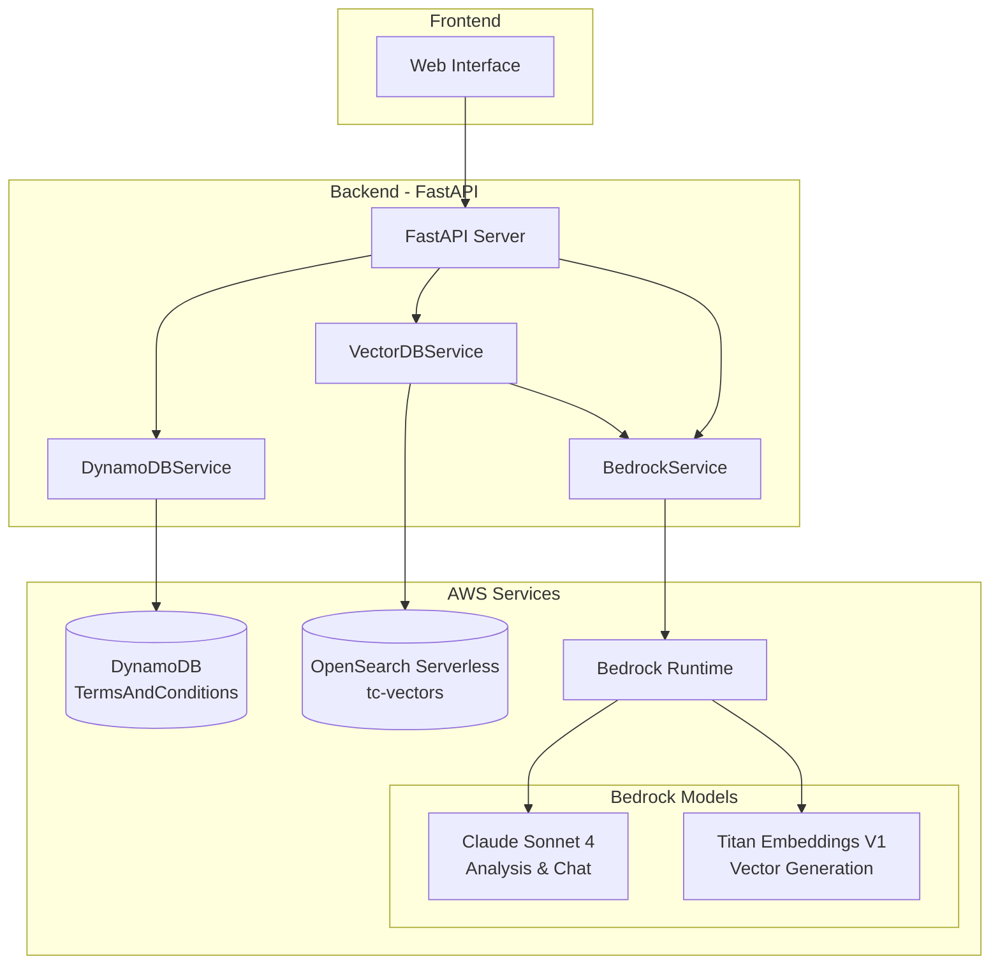
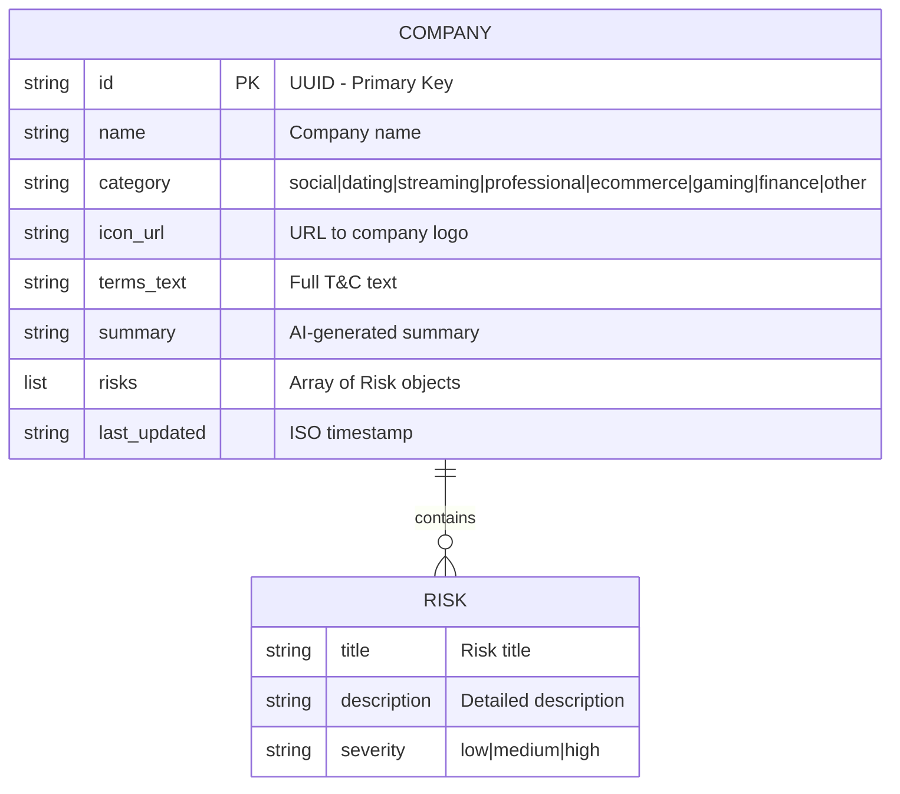
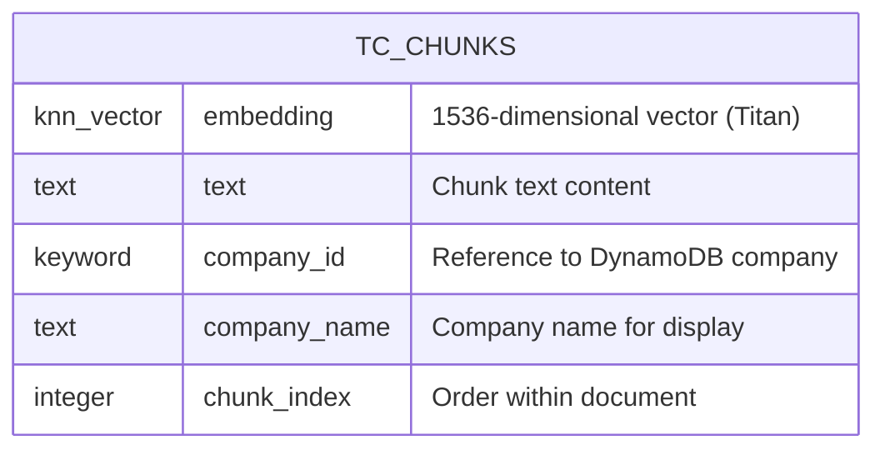
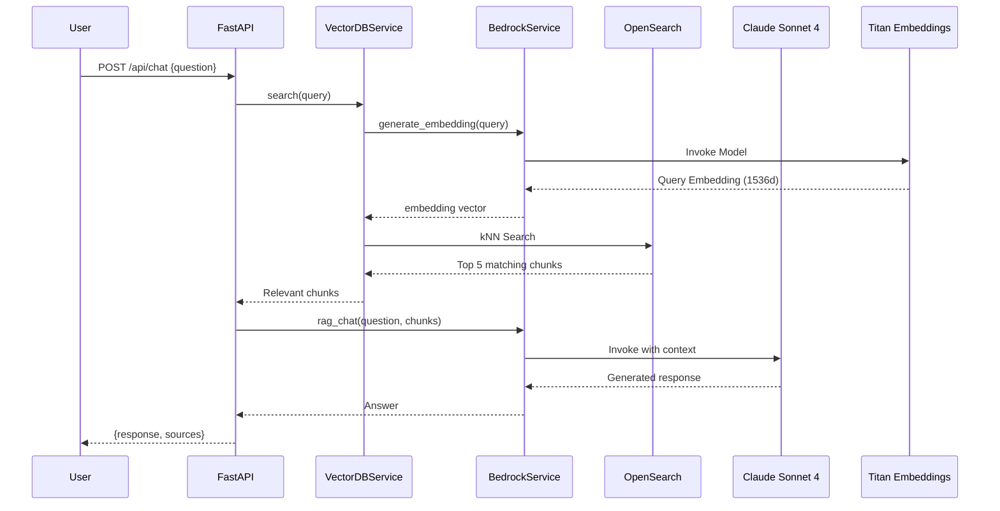
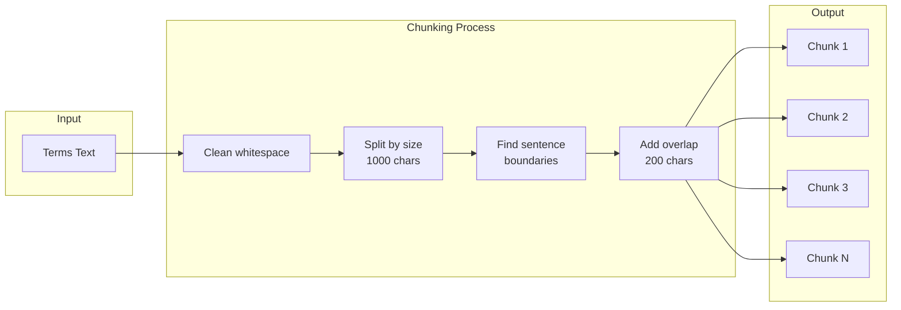
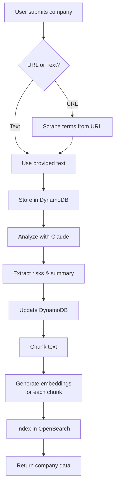
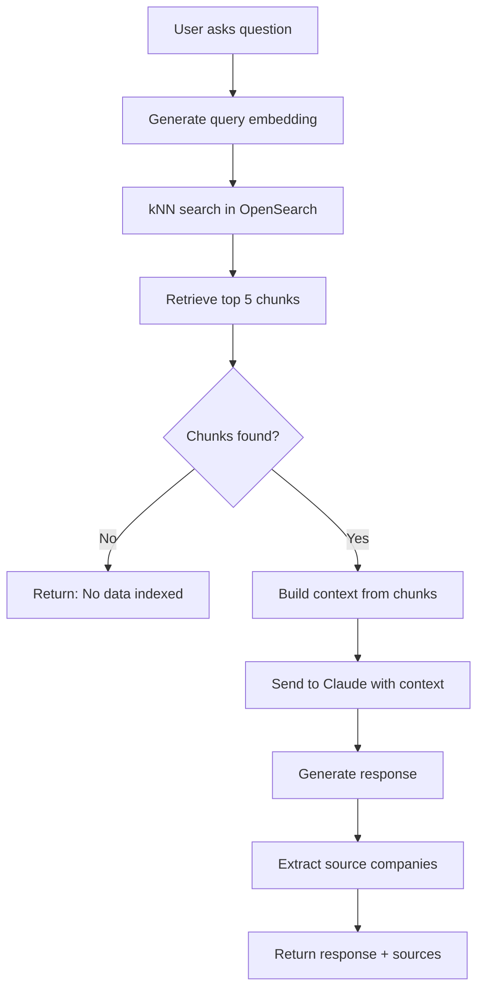

# Database Architecture and RAG Implementation

This document describes the database structure, AWS service connections, and RAG (Retrieval-Augmented Generation) implementation for the Terms & Conditions Risk Analyzer.

## System Architecture Overview



## AWS Services Configuration

### Region and Credentials

| Configuration | Value |
|---------------|-------|
| **Region** | `us-west-2` |
| **Authentication** | AWS IAM credentials via environment variables |

#### Required Environment Variables

```bash
export AWS_DEFAULT_REGION="us-west-2"
export AWS_ACCESS_KEY_ID="your-access-key-id"
export AWS_SECRET_ACCESS_KEY="your-secret-access-key"
export AWS_SESSION_TOKEN="your-session-token"  # If using temporary credentials
```

---

## DynamoDB - Company Metadata Storage

### Table Configuration

| Property | Value |
|----------|-------|
| **Table Name** | `TermsAndConditions` |
| **Billing Mode** | PAY_PER_REQUEST (On-Demand) |
| **Primary Key** | `id` (String, HASH) |

### Schema Structure



### Sample Document

```json
{
  "id": "4bf41b8a-ad56-4617-b6c5-529b73eb3173",
  "name": "LinkedIn",
  "category": "professional",
  "icon_url": "https://upload.wikimedia.org/wikipedia/commons/c/ca/LinkedIn_logo_initials.png",
  "terms_text": "LinkedIn Terms of Service Summary...",
  "summary": "Users agree to share extensive professional data...",
  "risks": [
    {
      "title": "Extensive Professional Data Collection",
      "description": "LinkedIn collects comprehensive professional information...",
      "severity": "medium"
    }
  ],
  "last_updated": "2025-11-26T10:36:33.835111"
}
```

### DynamoDB Connection Code

```python
import boto3
from boto3.dynamodb.conditions import Key

class DynamoDBService:
    def __init__(self):
        self.dynamodb = boto3.resource(
            'dynamodb',
            region_name='us-west-2',
            aws_access_key_id=os.getenv('AWS_ACCESS_KEY_ID'),
            aws_secret_access_key=os.getenv('AWS_SECRET_ACCESS_KEY'),
            aws_session_token=os.getenv('AWS_SESSION_TOKEN')
        )
        self.table = self.dynamodb.Table('TermsAndConditions')

    def get_company(self, company_id: str):
        response = self.table.get_item(Key={'id': company_id})
        return response.get('Item')
```

---

## OpenSearch Serverless - Vector Storage

### Collection Configuration

| Property | Value |
|----------|-------|
| **Collection Name** | `tc-vectors` |
| **Collection Type** | VECTORSEARCH |
| **Endpoint** | `mryy2glg64insuvi1bw6.us-west-2.aoss.amazonaws.com` |
| **Index Name** | `tc-chunks` |

### Index Mapping



### Index Settings

```json
{
  "settings": {
    "index": {
      "knn": true
    }
  },
  "mappings": {
    "properties": {
      "embedding": {
        "type": "knn_vector",
        "dimension": 1536,
        "method": {
          "name": "hnsw",
          "space_type": "cosinesimil",
          "engine": "faiss"
        }
      },
      "text": { "type": "text" },
      "company_id": { "type": "keyword" },
      "company_name": { "type": "text" },
      "chunk_index": { "type": "integer" }
    }
  }
}
```

### OpenSearch Serverless Connection Code

```python
import boto3
from opensearchpy import OpenSearch, RequestsHttpConnection
from requests_aws4auth import AWS4Auth

class VectorDBService:
    def __init__(self, bedrock_service):
        self.bedrock = bedrock_service
        self.index_name = "tc-chunks"
        self.collection_endpoint = "mryy2glg64insuvi1bw6.us-west-2.aoss.amazonaws.com"
        self.region = 'us-west-2'

        # Get AWS credentials
        session = boto3.Session()
        credentials = session.get_credentials()

        # Create AWS4Auth for OpenSearch Serverless (service: 'aoss')
        self.auth = AWS4Auth(
            credentials.access_key,
            credentials.secret_key,
            self.region,
            'aoss',  # Important: Use 'aoss' not 'es'
            session_token=credentials.token
        )

        # Initialize OpenSearch client
        self.client = OpenSearch(
            hosts=[{'host': self.collection_endpoint, 'port': 443}],
            http_auth=self.auth,
            use_ssl=True,
            verify_certs=True,
            connection_class=RequestsHttpConnection,
            timeout=30
        )
```

### Important Notes for OpenSearch Serverless

1. **No Document IDs**: OpenSearch Serverless does not support client-specified document IDs. Documents are auto-assigned IDs.

```python
# Correct - let OpenSearch generate ID
self.client.index(index=self.index_name, body=doc)

# Wrong - will throw error
self.client.index(index=self.index_name, id=doc_id, body=doc)
```

2. **Security Policies Required**: Three policies must be created:
   - Encryption policy
   - Network policy
   - Data access policy

---

## RAG Implementation

### RAG Flow Diagram



### Text Chunking Strategy



### Chunking Parameters

| Parameter | Value | Description |
|-----------|-------|-------------|
| `chunk_size` | 1000 chars | Maximum characters per chunk |
| `overlap` | 200 chars | Overlap between consecutive chunks |
| Sentence boundaries | `. ` `.\\n` `? ` `?\\n` `! ` `!\\n` | Preferred split points |

### Embedding Generation

```python
def generate_embedding(self, text: str) -> List[float]:
    """Generate embeddings using Amazon Titan Embeddings V1"""
    text = text[:8000]  # Titan has 8k token limit

    body = json.dumps({"inputText": text})

    response = self.client.invoke_model(
        modelId="amazon.titan-embed-text-v1",
        body=body,
        contentType="application/json",
        accept="application/json"
    )

    response_body = json.loads(response['body'].read())
    return response_body['embedding']  # Returns 1536-dimensional vector
```

### Vector Search Query

```python
def search(self, query: str, n_results: int = 5, company_id: str = None):
    # Generate query embedding
    query_embedding = self.bedrock.generate_embedding(query)

    # Build kNN query
    knn_query = {
        "knn": {
            "embedding": {
                "vector": query_embedding,
                "k": n_results
            }
        }
    }

    # Add company filter if specified
    if company_id:
        search_body = {
            "size": n_results,
            "query": {
                "bool": {
                    "must": [knn_query],
                    "filter": [{"term": {"company_id": company_id}}]
                }
            }
        }
    else:
        search_body = {"size": n_results, "query": knn_query}

    # Execute search
    response = self.client.search(index=self.index_name, body=search_body)
    return response['hits']['hits']
```

### RAG Chat Generation

```python
def rag_chat(self, user_question: str, context_chunks: List[Dict],
             conversation_history: List[Dict] = None) -> str:
    # Build context from retrieved chunks
    context_text = ""
    for i, chunk in enumerate(context_chunks, 1):
        company = chunk.get('company_name', 'Unknown')
        text = chunk.get('text', '')
        context_text += f"\n[Source {i} - {company}]:\n{text}\n"

    system_prompt = """You are a helpful assistant that explains Terms
    and Conditions in simple, clear language. Always cite which company's
    terms you're referencing in your answers."""

    user_prompt = f"""Based on the following excerpts from Terms and Conditions:
    {context_text}

    User question: {user_question}

    Please provide a clear, helpful answer based on the context above."""

    # Call Claude Sonnet 4
    body = json.dumps({
        "anthropic_version": "bedrock-2023-05-31",
        "max_tokens": 2048,
        "temperature": 0.5,
        "system": system_prompt,
        "messages": [{"role": "user", "content": user_prompt}]
    })

    response = self.client.invoke_model(
        modelId="us.anthropic.claude-sonnet-4-20250514-v1:0",
        body=body
    )
    return response['content'][0]['text']
```

---

## Data Flow Diagrams

### Company Creation Flow



### Chat Query Flow



---

## API Endpoints

| Endpoint | Method | Description |
|----------|--------|-------------|
| `/api/companies` | GET | List all companies |
| `/api/companies/{id}` | GET | Get single company |
| `/api/companies` | POST | Create company + analyze |
| `/api/companies/{id}/analyze` | POST | Re-analyze company |
| `/api/companies/{id}` | DELETE | Delete company |
| `/api/chat` | POST | RAG-powered chat |
| `/api/index-all` | POST | Index all companies |
| `/api/vector-stats` | GET | Get vector DB stats |
| `/api/seed` | POST | Load sample data |

---

## Dependencies

```
boto3==1.34.0
opensearch-py>=3.0.0
requests-aws4auth>=1.3.0
fastapi==0.104.1
pydantic==2.5.0
```

---

## Troubleshooting

### Common Issues

1. **"Document ID is not supported"** - OpenSearch Serverless error
   - Remove `id=` parameter from index calls

2. **Authentication errors**
   - Ensure AWS credentials are set in environment
   - Check IAM role has required permissions

3. **Index not found (404)**
   - Index is created lazily on first use
   - Check data access policy permissions

4. **Empty search results**
   - Run `/api/index-all` to populate vector index
   - Check `/api/vector-stats` for chunk count
